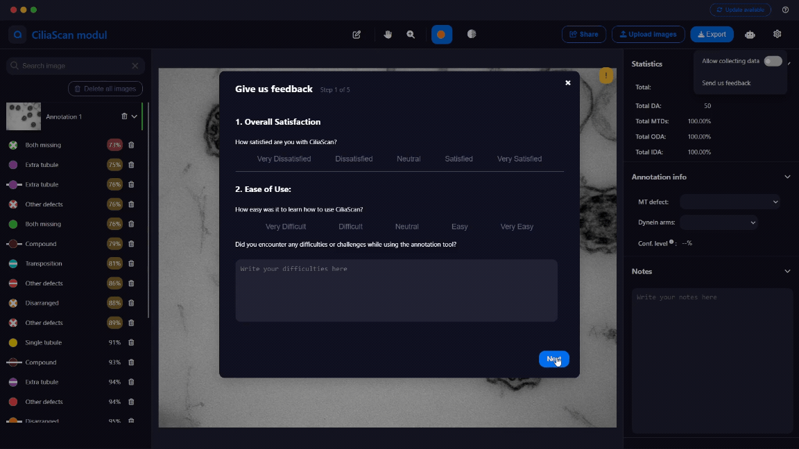
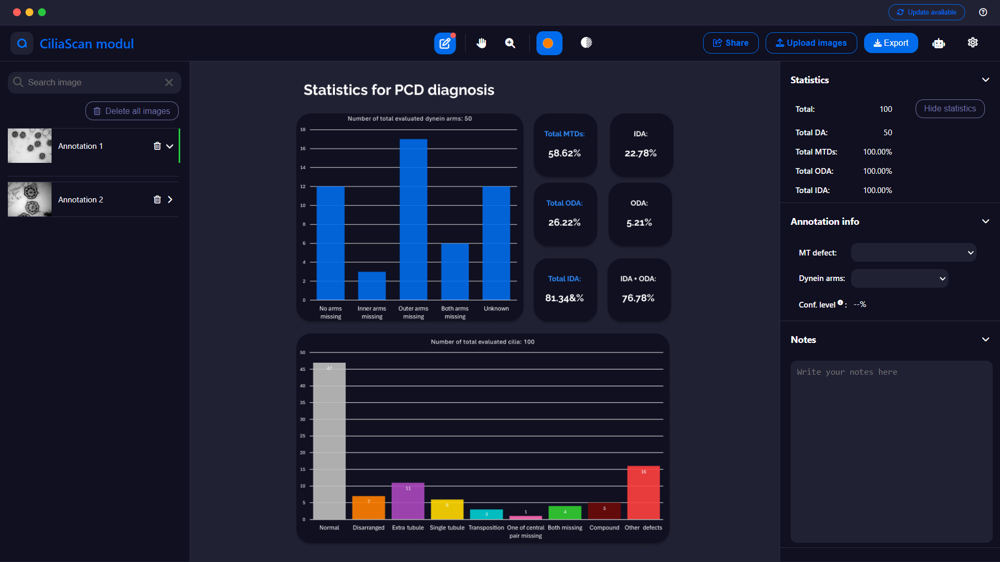
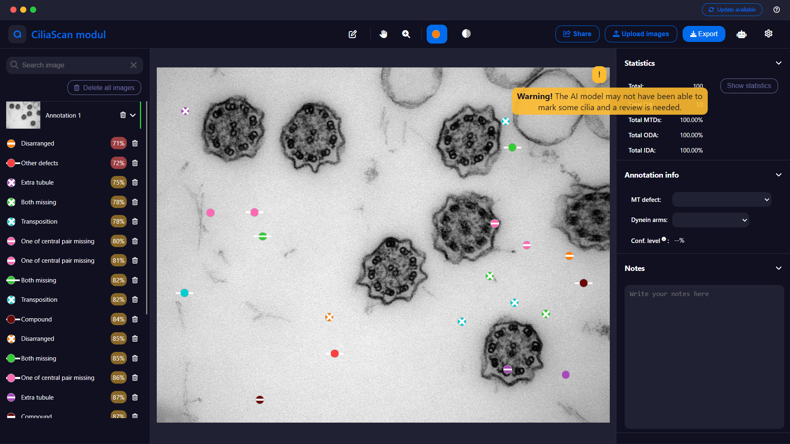
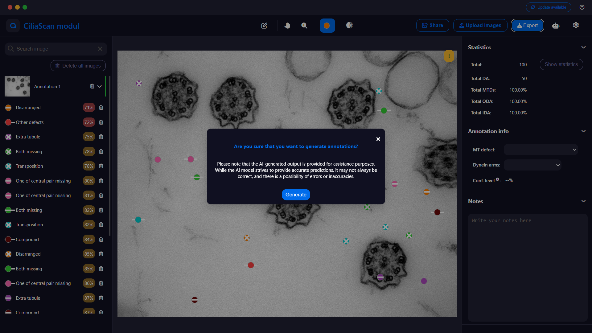
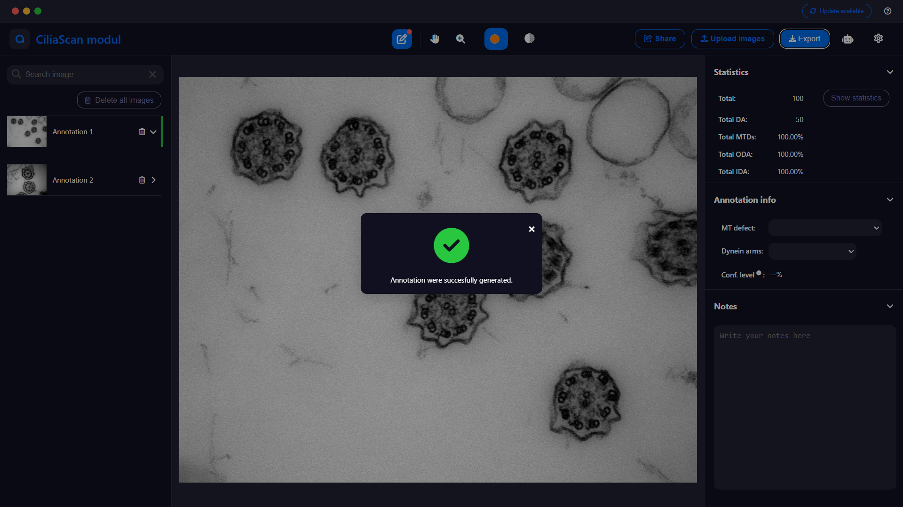

# CiliaScan: Cilia edition

Html+css+js prototype of application for annotating cilias. The annotations are randomly placed inside the image.

## Install

to run this version you can simply open `index.html` in your browser or use vscode extenstion `Live Server` (id: `ritwickdey.LiveServer`) and run in within the folder.

> ⚠️ It is important to note that it was design for one laptop screen and might (will) break for others 🙃. To see how it looks refer to images in **Preview of screens** or `screens`

## Preview of screens

